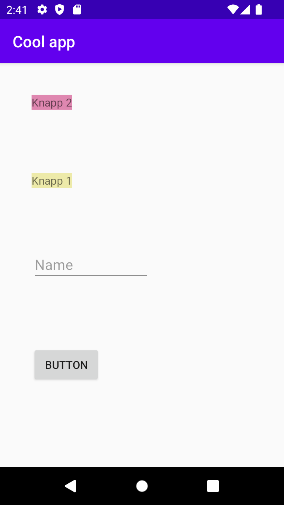

# Rapport
```
Jag ändrade namnet på appen till "Cool app" genom att lägga till en string:
 "<string name="app_name">Cool app</string>" i string-filen
 och sedan lade till denna kod i AndroidManifest-filen
:
        "android:allowBackup="true"
        android:icon="@mipmap/ic_launcher"
        android:label="@string/app_name"
        android:roundIcon="@mipmap/ic_launcher_round"
        android:supportsRtl="true"
        android:theme="@style/AppTheme">"

Efter detta lade jag till två Textviews som heter "Knapp1" och "Knapp2".
Under dessa lade jag till en EditText som har placeholdern "Name".
Till sist lade jag till en knapp som heter "BUTTON" och ändra därefter margin
till margin på alla widgets till 40dp. Exempel visas nedan:
<Button
            android:layout_width="wrap_content"
            android:layout_height="wrap_content"
            android:drawablePadding="4dp"
            android:layout_margin="40dp"
            android:text="@string/button" />
```




Läs gärna:

- Boulos, M.N.K., Warren, J., Gong, J. & Yue, P. (2010) Web GIS in practice VIII: HTML5 and the canvas element for interactive online mapping. International journal of health geographics 9, 14. Shin, Y. &
- Wunsche, B.C. (2013) A smartphone-based golf simulation exercise game for supporting arthritis patients. 2013 28th International Conference of Image and Vision Computing New Zealand (IVCNZ), IEEE, pp. 459–464.
- Wohlin, C., Runeson, P., Höst, M., Ohlsson, M.C., Regnell, B., Wesslén, A. (2012) Experimentation in Software Engineering, Berlin, Heidelberg: Springer Berlin Heidelberg.
